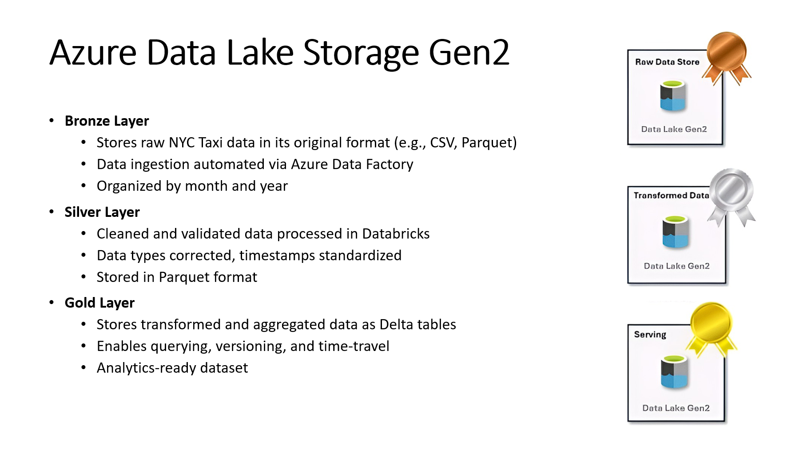
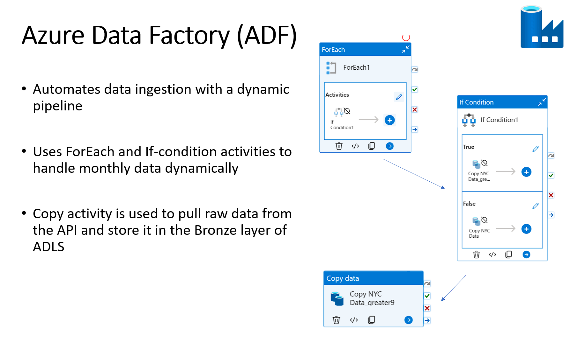
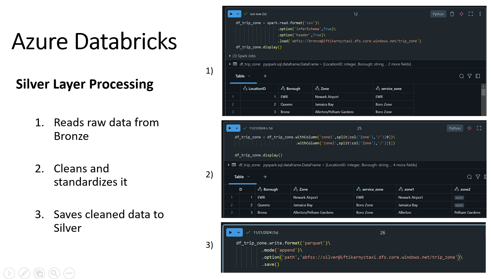
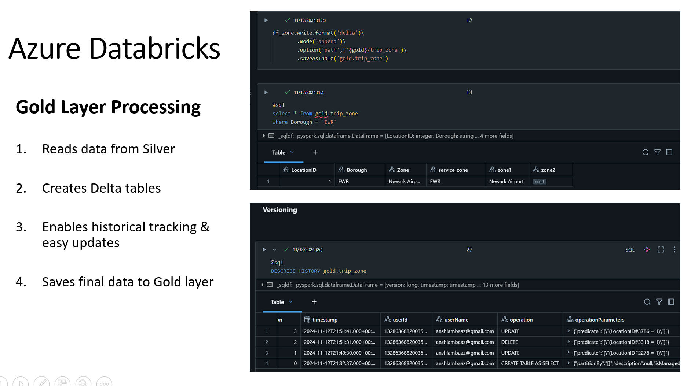

# NYC Taxi Data Engineering: Azure-Powered Medallion Architecture

## Project Synopsis
This repository showcases an advanced data engineering solution leveraging Azure services to process and analyze NYC Taxi data. The project implements the Medallion Architecture, demonstrating a sophisticated approach to data refinement and analysis.

## Architectural Overview

The solution employs a three-tiered data processing model:
1. Bronze: Raw data ingestion
2. Silver: Data cleansing and validation
3. Gold: Analytics-ready data

## Data Source
The project utilizes 2023 Green Taxi trip records, which provide detailed information about taxi trips in New York City. The dataset encompasses:
- Pick-up and drop-off timestamps
- Trip locations and distances
- Fare details
- Passenger counts

[Access the NYC TLC Trip Record Data](https://www.nyc.gov/site/tlc/about/tlc-trip-record-data.page)

## Azure Services Utilized

### Azure Data Lake Storage Gen2 (ADLS)
- **Bronze Layer**: Houses raw NYC Taxi data
- **Silver Layer**: Stores cleaned and validated data
- **Gold Layer**: Contains analytics-ready Delta tables

 

### Azure Data Factory (ADF)
Orchestrates data ingestion with a dynamic pipeline:
- Employs ForEach and If-condition activities
- Utilizes Copy activity for data transfer
 

### Azure Databricks
Handles data processing and transformation:

  
  

- [Silver Layer Notebook](Azure_Databricks_Notebook/silver_notebook.ipynb)
- [Gold Layer Notebook](Azure_Databricks_Notebook/gold_notebook.ipynb)

### Service Principal
Ensures secure authentication between Databricks and ADLS.

### Power BI Integration
Connects to Databricks for data visualization.

## Implementation Highlights
- Dynamic data ingestion pipeline in ADF
- Data cleansing and type correction in Databricks
- Delta table creation for advanced data management
- Seamless integration with Power BI for analytics

This project exemplifies a robust, scalable framework for processing and analyzing large-scale datasets using Azure's powerful suite of data services.
